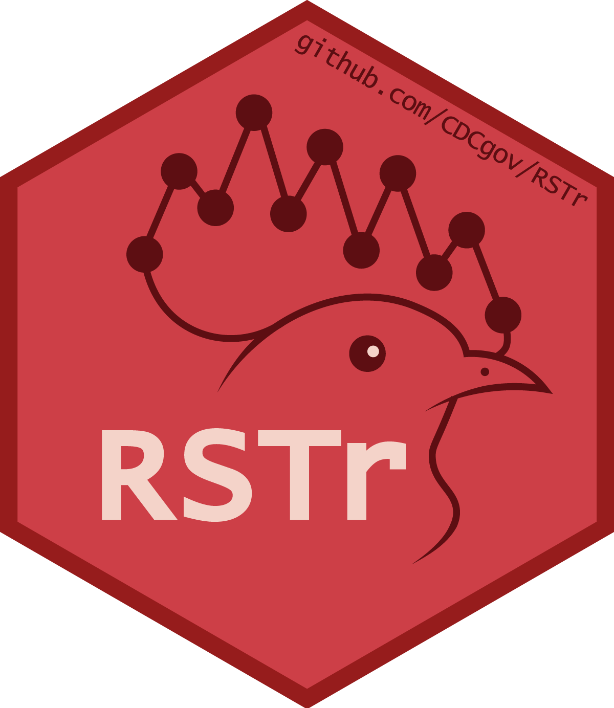

# RSTr  
The Rate Stabilizing Tool R Package (RSTr): Gibbs Samplers for Bayesian Spatiotemporal CAR Models

The RSTr package is a tool that uses Bayesian spatiotemporal models in conjunction with C++ to help you quickly and easily generate spatially smoothed estimates for your spatiotemporal small area data. For the ArcGIS Plugin, visit the [RSTbx Plugin webpage](https://github.com/CEHI-code-repos/RateStabilizingToolbox).

## Installation

To install the RSTr package, a few dependent packages are needed first. RSTr depends on the following:

##### Packages
- [Rcpp](https://cran.r-project.org/package=Rcpp): Rcpp is a package that allows integration of C++ code into R.
- [RcppArmadillo](https://cran.r-project.org/package=RcppArmadillo): This is an addon for Rcpp that facilitates matrix and array manipulation.
- [RcppDist](https://cran.r-project.org/package=RcppDist): This is an addon for Rcpp that allows the generation of values for specialized distributions.
- [abind](https://cran.r-project.org/package=abind): A package designed to combine multidimensional arrays. Necessary for the concatenation of large arrays when gathering samples.
- [knitr](https://cran.r-project.org/package=knitr): Allows for creation of package vignettes.
##### Programs
- [RTools](https://cran.r-project.org/bin/windows/Rtools/) (Windows Only): C++ compiler for R. Necessary for Rcpp and its dependencies. Only necessary on Windows devices, as Linux and Mac devices have native C++ compilers.

### Installation Instructions
From the R console, make sure that all the necessary dependencies are installed by running the following lines:

```sh
# Install dependent packages
install.packages(c("Rcpp", "RcppArmadillo", "RcppDist", "abind", "knitr"))
```
```sh
# Install RTools
install.packages("installr") # Optional for Windows users. RTools can also be downloaded and installed manually from the above URL.
installr::install.Rtools()
```
Then, the package can be installed from GitHub:
```sh
install.packages("remotes") # Optional if you already have an R package which can install from GitHub
remotes::install_github("CEHI-code-repos/RSTr", build_vignettes = TRUE)
```
If this is your first time using the RSTr package, check the introductory vignette to learn how to use the package:
```sh
vignette("RSTr")
```

### Updates
To update RSTr, remove the package from R, restart R, and re-install from GitHub:
```sh
remove.packages("RSTr")
# Restart R to allow package installation
remotes::install_github("CEHI-code-repos/RSTr", build_vignettes = TRUE)
```

## Thanks!
Thanks for checking out the RSTr package. I hope you find it useful in your spatiotemporal modeling! Please feel free to give feedback on bugs, ways to make the package more accessible to use, and features you'd like to see added to the package.
