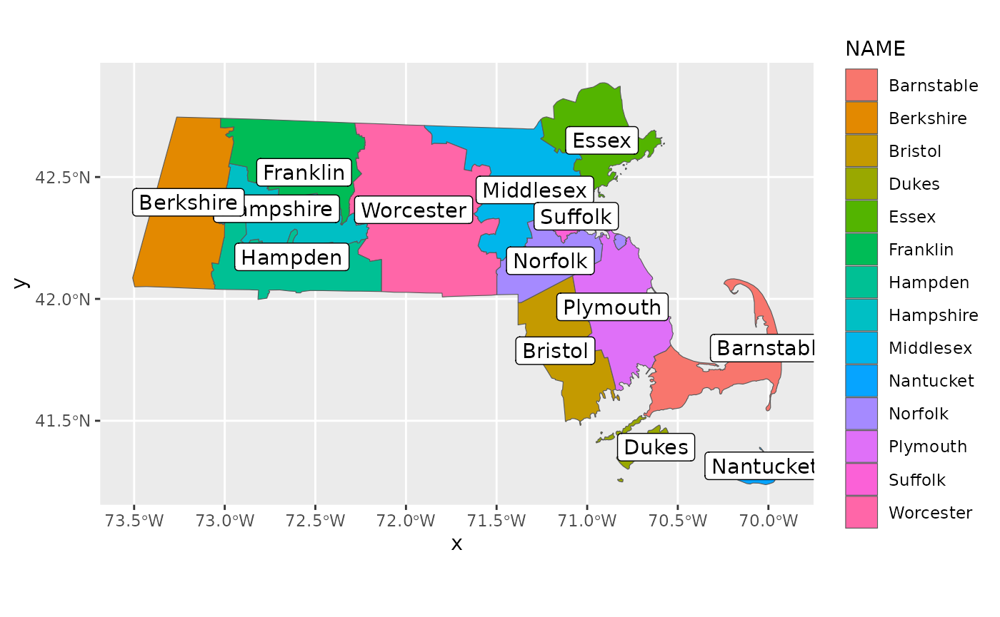

# 02: Understanding and Preparing Your Adjacency Structure

## Overview

The adjacency structure is a set of instructions that show the spatial
relationship between each region and informs `RSTr` which counties to
pull information from when spatially smoothing. In this vignette, we
will cover the requirements for the `adjacency` object along with
walking through the setup of the adjacency information.

## Requirements

Adjacency information is input as a `list` `adj` where each element
`adj[[i]]` is a vector of indices denoting regions that are neighbors of
region `i`. Below, we will walk through the construction of the
adjacency information and address common issues that may arise.

## Example: Massachusetts Map Data

For this example, we will continue using Massachusetts data as we did in
section 2. Included is an example dataset that contains Massachusetts
shapefile information, generated using the `tigris` package:

``` r
library(RSTr)

head(mamap)
```

This dataset contains several variables related to Census information on
Massachusetts, but for our purposes we are only interested in two
variables:

- `GEOID` contains the FIPS code for each county. We can use this to
  associate each county with the counties in our event/population data;
  and

- `geometry` describes how to map each region. We can use this to
  generate our adjacency information.

To begin, let’s first arrange `mamap` by `GEOID` to ensure the counties
are in the same order as our `maexample` data, then generate some
adjacency information using the `spdep` package:

``` r
library(dplyr)
#> 
#> Attaching package: 'dplyr'
#> The following objects are masked from 'package:stats':
#> 
#>     filter, lag
#> The following objects are masked from 'package:base':
#> 
#>     intersect, setdiff, setequal, union
library(spdep)
#> Loading required package: spData
#> To access larger datasets in this package, install the spDataLarge
#> package with: `install.packages('spDataLarge',
#> repos='https://nowosad.github.io/drat/', type='source')`
#> Loading required package: sf
#> Linking to GEOS 3.12.1, GDAL 3.8.4, PROJ 9.4.0; sf_use_s2() is TRUE

ma_shp <- arrange(mamap, GEOID)
ma_adj <- poly2nb(ma_shp)
#> Warning in poly2nb(ma_shp): some observations have no neighbours;
#> if this seems unexpected, try increasing the snap argument.
#> Warning in poly2nb(ma_shp): neighbour object has 3 sub-graphs;
#> if this sub-graph count seems unexpected, try increasing the snap argument.
```

The
[`poly2nb()`](https://r-spatial.github.io/spdep/reference/poly2nb.html)
function takes the information in `ma_shp$geometry` and looks for any
regions with touching boundaries (i.e., queen contiguity). `ma_adj` is a
list that contains the indices of each region that is a neighbor with a
given region. Looking at `ma_adj` gives us some more information:

``` r
ma_adj
#> Neighbour list object:
#> Number of regions: 14 
#> Number of nonzero links: 38 
#> Percentage nonzero weights: 19.38776 
#> Average number of links: 2.714286 
#> 2 regions with no links:
#> 4, 10
#> 3 disjoint connected subgraphs
```

`ma_adj` tells that there are 14 regions linked in 38 unique ways.
However, it also notes that there are two regions with no links. Regions
with no links are problematic for `RSTr` because it has no information
with which to spatially smooth, causing the model to crash. Because our
data is in this incomplete format, we will have to do some investigation
and fixing to get it ready for use.

Let us first look at the dataset to see which counties have no
neighbors. `ma_adj` tells us that regions 4 and 10 are our regions with
no links, but we can also use the data generated by
[`poly2nb()`](https://r-spatial.github.io/spdep/reference/poly2nb.html)
to give us the indices of our no-link counties. `poly2nb` assigns
regions without links a 0:

``` r
no_neigh <- which(sapply(ma_adj, \(x) all(x == 0)))
```

Using the [`sapply()`](https://rdrr.io/r/base/lapply.html) function, we
can return a `logical` vector that checks each element of `ma_adj` for
zeros. Then, with [`which()`](https://rdrr.io/r/base/which.html), we
specify the indices where our `logical` is true. We can now investigate
`ma_shp` for which counties have no neighbors:

``` r
ma_shp[no_neigh, ]
#> Simple feature collection with 2 features and 12 fields
#> Geometry type: MULTIPOLYGON
#> Dimension:     XY
#> Bounding box:  xmin: -70.95137 ymin: 41.23796 xmax: -69.96018 ymax: 41.52178
#> Geodetic CRS:  NAD83
#>    STATEFP COUNTYFP COUNTYNS       AFFGEOID GEOID      NAME         NAMELSAD
#> 4       25      007 00606930 0500000US25007 25007     Dukes     Dukes County
#> 10      25      019 00606936 0500000US25019 25019 Nantucket Nantucket County
#>    STUSPS    STATE_NAME LSAD     ALAND     AWATER
#> 4      MA Massachusetts   06 267292993 1004291414
#> 10     MA Massachusetts   06 119637319  666826424
#>                          geometry
#> 4  MULTIPOLYGON (((-70.8071 41...
#> 10 MULTIPOLYGON (((-70.23405 4...
```

According to this, our two no-link counties are Dukes and Nantucket
(FIPS 25007 and 25019, respectively). Let’s check out a ggplot of our
data to further investigate:

``` r
library(ggplot2)

ggplot(mamap) +
  geom_sf(aes(fill = NAME)) +
  geom_sf_label(aes(label = NAME))
```



Here, we’ve generated a map colored by region and labeled with the name
of each county. We can see Dukes and Nantucket in the southeast corner,
and if you zoom in, you can see that these two counties aren’t touching
any other counties. Upon closer inspection, Barnstable County seems like
a good contender for a neighbor to both Dukes and Nantucket County;
Dukes and Nantucket County are also close enough to be neighbors to each
other. To rectify this, we can manually make some changes to our
adjacency information. Let’s first get a feel for which counties are
associated with which indices:

``` r
county_key <- seq_along(ma_shp$NAME)
names(county_key) <- ma_shp$NAME
county_key
#> Barnstable  Berkshire    Bristol      Dukes      Essex   Franklin    Hampden 
#>          1          2          3          4          5          6          7 
#>  Hampshire  Middlesex  Nantucket    Norfolk   Plymouth    Suffolk  Worcester 
#>          8          9         10         11         12         13         14
```

We can see that Barnstable has an index of 1, Dukes has an index of 4,
and Nantucket has an index of 10. We can use the
[`add_neighbors()`](../reference/add_neighbors.md) function to set these
counties as mutual neighbors:

``` r
ma_adj <- add_neighbors(ma_adj, c(1, 4, 10))
```

Now if we look at `ma_adj`, the message about no-link regions is gone.

One last feature we can add to these adjacencies are dimension names.
This isn’t necessary, but it can be useful to associate regions in our
`data` object with regions inside of our adjacency structure:

``` r
names(ma_adj) <- ma_shp$GEOID
for (i in seq_along(ma_adj)) {
  names(ma_adj[[i]]) <- ma_shp$GEOID[ma_adj[[i]]]
}
```

The above code assigns each FIPS code to each element of `ma_adj`, then
assigns the indices inside of each element of `ma_adj` to its associated
FIPS code.

Note that if you run a model in `RSTr` and load in the adjacency
information saved in your model’s `spatial_data.Rds` file, the indices
will have changed. This is because `ma_adj` is only used within Rcpp,
which uses a 0-indexing system as opposed to the 1-indexing system used
by R. When inputting data into `initialize_*()`, only use a 1-indexed
adjacency structure.

Finally, even though we connected the two island counties to the
mainland counties of MA, as long as each region has at least one
neighbor, it is usable within `RSTr`. This means that, theoretically, we
could have made just Dukes and Nantucket neighbors of each other,
creating two separate islands with no related neighbors. In this case,
every region on both islands still has at least one neighbor.

## Closing Thoughts

In this vignette, we used the
[`poly2nb()`](https://r-spatial.github.io/spdep/reference/poly2nb.html)
function inside of the `spdep` package to generate our adjacency
structure. We then fixed issues with counties without neighbors and
applied a naming scheme to the adjacency information consistent with the
`data` object created in section 2. From here, the `RSTr` model is ready
to be run with our `data` and `adjacency` information!
