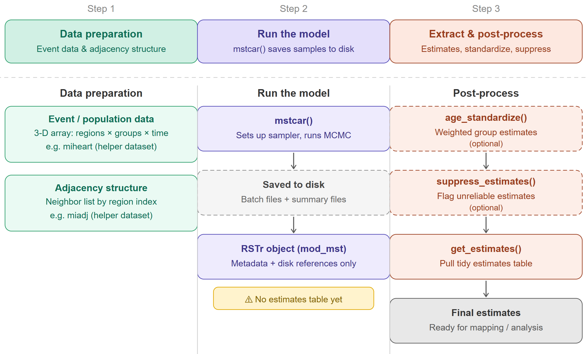
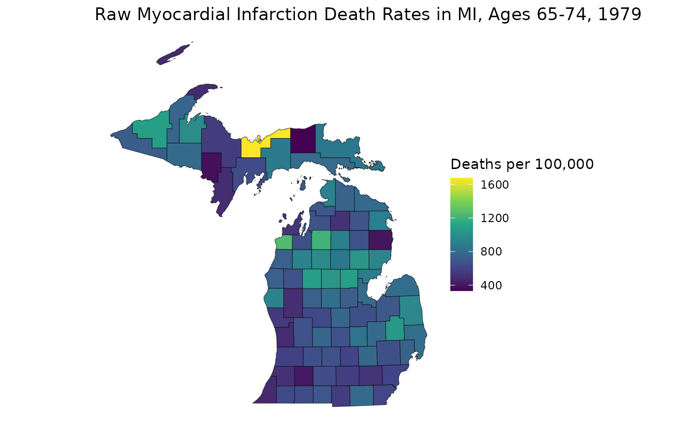
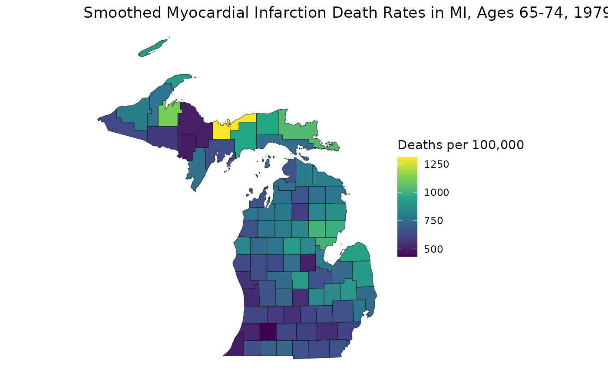

# An Introduction to the RSTr Package

## Overview

RSTr is an R package that provides a host of Bayesian spatiotemporal
models in conjunction with Rcpp to quickly and easily generate
spatially-smoothed age-standardized estimates for your spatial data.
This vignette introduces you to the basics of the RSTr package and shows
you how to apply the basic functions to the included example data in a
three-step workflow to get small area estimates: (1) data preparation,
(2) running the model, and (3) extracting and post-processing estimates.

## Models

The models provided in the RSTr package are based on the [Besag, York,
and Mollié (1991)](https://link.springer.com/article/10.1007/bf00116466)
Conditional Autoregressive (CAR) model, which spatially smooths data by
incorporating information such as event and population counts from
neighboring geographic units (counties, census tracts, etc.). The degree
of spatial smoothing is determined by a spatial region’s respective
population size. These spatially smoothed estimates are generated based
on the posterior samples generated in an MCMC algorithm. The CAR model
can be extended to several levels of complexity, depending on the input
data:

- BYM CAR (CAR): Spatially smooths across geographies;

- Restricted CAR (RCAR): Spatially smooths across geographies and
  prevents over-smoothing;

- Multivariate CAR (MCAR): Spatially smooths across geographies and
  sociodemographic groups; and

- Multivariate Spatiotemporal CAR (MSTCAR): Spatially smooths across
  geographies, sociodemographic groups, and time periods.

For this vignette, we will demonstrate RSTr’s functionality with an
MSTCAR model.

## Example workflow with the MSTCAR model

The process of generating estimates with RSTr can be separated into
three main steps: data preparation, model running, and estimate
extraction. In the following section, we will work through each step
one-by-one, using example data provided with RSTr. Here is a chart
describing the three steps of the workflow:



### Data preparation

Models with RSTr take, at a minimum, two pieces of data:
event/population data, and adjacency information. Event and population
data are packaged into a single `list` object, and the adjacency
information is a neighbors `list` based on contiguous boundaries.

#### Event/population data

RSTr requires event counts for a parameter of interest, stratified by
region, group, and time period, and its corresponding population counts.
Event/population data must be organized in a very specific manner.
RSTr’s models can accept up to three-dimensional arrays: in the MSTCAR
model, for example, spatial regions must be on the rows,
socio/demographic groups must be on the columns, and time periods must
be on the matrix slices. In the current version of RSTr, universal data
is required - the models are not yet designed to handle survey data.

RSTr includes `miheart`, a helper dataset included with RSTr for
demonstration purposes. When running your own analysis, you will
substitute this with your own event/population data structured in the
same format. `miheart` is binomial-distributed myocardial infarction
deaths in six age groups from 1979-1988 in Michigan. Reference `miheart`
to see how this data looks or [`?miheart`](../reference/miheart.md) for
more information on the dataset.

For more information on preparing your event data, read
[`vignette("RSTr-event")`](../articles/RSTr-event.md)

#### Adjacency information

The adjacency information is a `list` that tells RSTr which regions are
neighbors of one other based on their region index (i.e., the order they
appear in the dataset). Every region must have at least one neighbor.
The adjacency structures must be listed in the same order as your count
data. The easiest way to generate this adjacency information is through
the
[`spdep::poly2nb()`](https://r-spatial.github.io/spdep/reference/poly2nb.html)
function.

RSTr includes `miadj`, a helper dataset included with RSTr for
demonstration purposes. When running your own analysis, you will
substitute this with an adjacency structure derived from your own
shapefile, for example using
[`spdep::poly2nb()`](https://r-spatial.github.io/spdep/reference/poly2nb.html).
For more information on preparing your adjacency data, read
[`vignette("RSTr-adjacency")`](../articles/RSTr-adjacency.md).

### Running the model

RSTr’s `*car()` functions create an `RSTr` model object which contains
all the information needed to run a model, such as the number of
iterations, the model type, the current sample value, etc. This model
object is periodically saved into a model folder `name`, which lives
under the directory `dir`. As the models run, the MCMC samples are also
saved in the model folder. A random seed can also be specified directly
within the `*car()` functions for replicability purposes.

With our data set up and a knowledge of the basic components of the
`*car()` functions, we can run our first model. Let’s use the provided
Michigan example data, `miheart` and `mishp`:

``` r

mod_mst <- mstcar(
  name = "my_test_model",
  data = miheart,
  adjacency = miadj,
  dir = tempdir(),
  seed = 1234
)
```


Here, we use the [`mstcar()`](../reference/car.md) function to specify
our model. [`mstcar()`](../reference/car.md) accepts a few different
arguments:

- The `name` argument specifies the folder where the model data lives;
- The `data` argument specifies event/population data;
- The `adjacency` argument specifies our adjacency structure;
- The `dir` argument specifies the directory where to save the folder;
  and
- The `seed` argument specifies the random seed.

[`mstcar()`](../reference/car.md) sets up the sampler, runs 6,000 MCMC
iterations in 60 batches of 100, and saves the results locally inside
the folder specified by dir/name (e.g., tempdir()/my_test_model).
Samples are not held in RAM because large MSTCAR models can exceed
available memory.

The `mod_mst` object created in your R environment does not contain a
table of estimates. Instead, it stores model metadata (name, type,
number of samples, etc.) and references to where the samples and
summaries are saved on disk.

Note that [`mstcar()`](../reference/car.md) accepts more arguments than
are used here, but these are the only ones needed to get started. Priors
and initial values, for example, can be specified manually, but this is
outside the scope of this vignette. There will also be checks performed
on the input data: if something is wrong, warnings and error messages
will tell you what is wrong and how to fix it. For a list of diagnostic
errors and what they mean, read `vignette("RSTr-troubleshooting")`.

Console outputs will show the current batch number, the progress within
that batch, and the elapsed time. The model `Rds` file will be updated
as the sampler progresses in case you need to reload your model at a
later date. If the model crashes for any reason or R closes while the
model is being run, the model `Rds` file will keep track of the current
batch and pick back up where it left off when re-run. While
[`mstcar()`](../reference/car.md) is running, the R plot window will
show traceplots from a selection of estimates to check stability and
diagnose any potential issues.

[`mstcar()`](../reference/car.md) takes care of the vast majority of
model preparation: within the function, the model is set up, samples are
generated, and our medians are estimated. Once the function finishes, we
can get an overview of our model:

``` r

mod_mst
#> RSTr object:
#> 
#> Model name: my_test_model 
#> Model type: MSTCAR 
#> Data likelihood: binomial 
#> Estimate Credible Interval: 95% 
#> Number of geographic units: 83 
#> Number of samples: 6000 
#> Estimates age-standardized: No 
#> Estimates suppressed: No
```

Here, we get a birds-eye-view of the model, including the model we used
(MSTCAR), the data likelihood type, the number of geographic units, and
whether our estimates have been age-standardized or suppressed along
reliability criteria.

Note that running [`mstcar()`](../reference/car.md) does not produce a
ready-to-use table of estimates in memory.
[`mstcar()`](../reference/car.md) only sets up the sampler, runs it, and
saves raw samples and summaries to disk. Estimates must be extracted
using the [`get_estimates()`](../reference/get_estimates.md) function
described in the following section.

If you want to learn more about [`mstcar()`](../reference/car.md) and
the other model functions, read
[`vignette("RSTr-car")`](../articles/RSTr-car.md).

### Estimate extraction

Now that we’ve run the [`mstcar()`](../reference/car.md) function, how
do we get our estimates? The estimates are saved to disk and referenced
by `mod_mst`, but because this object also holds all information related
to the model, we have to extract the estimates specifially using other
RSTr functions.

With the [`get_estimates()`](../reference/get_estimates.md) function, we
can get a more detailed look at our estimates. For this type of
mortality data, it is common to observe the rates per 100,000
population, so we set the `rates_per` argument in
[`get_estimates()`](../reference/get_estimates.md) to 1e5:

``` r

mst_estimates <- get_estimates(mod_mst, rates_per = 1e5)
head(mst_estimates)
#>   county group year  medians ci_lower ci_upper rel_prec events population
#> 1  26001 35-44 1979 44.02662 30.63858 67.32566 1.200058      1        964
#> 2  26001 35-44 1980 46.67253 32.53640 69.47535 1.263505      1        995
#> 3  26001 35-44 1981 38.06884 22.83596 57.40519 1.101235      0        988
#> 4  26001 35-44 1982 39.29927 23.16532 57.79578 1.134818      1       1018
#> 5  26001 35-44 1983 40.18206 25.82975 59.35202 1.198668      2       1039
#> 6  26001 35-44 1984 31.84594 19.06423 46.29784 1.169362      0       1058
```

The `mst_estimates` object contains in-depth information about our model
estimates, including the medians, the credible intervals, the relative
precisions, and the event/population counts; region, group, and time
period columns are also provided.

### Age-standardization

One of the most important features of the RSTr package is the ability to
easily generate age-standardized estimates. Let’s say we want to get
age-standardized estimates for the 35-64 age group; for our model, we
use the [`age_standardize()`](../reference/age_standardize.md) function,
then specify the groups of interest, their associated standard
populations, and the name we want to give them. Since we are using data
from 1979-1988, we can use 1980 standard populations from
[NIH](https://seer.cancer.gov/stdpopulations/stdpop.19ages.html) to
generate a `std_pop` standard population vector:

``` r

std_pop <- c(68775, 34116, 9888)
mod_mst <- age_standardize(mod_mst, std_pop, new_name = "35-64", groups = c("35-44", "45-54", "55-64"))
mod_mst
#> RSTr object:
#> 
#> Model name: my_test_model 
#> Model type: MSTCAR 
#> Data likelihood: binomial 
#> Estimate Credible Interval: 95% 
#> Number of geographic units: 83 
#> Number of samples: 6000 
#> Estimates age-standardized: Yes 
#> Age-standardized groups: 35-64 
#> Estimates suppressed: No
```

Notice now that the `mod_mst` object indicates we have age-standardized
our estimates and the names of our age-standardized groups.

``` r

mst_estimates_as <- get_estimates(mod_mst)
head(mst_estimates_as)
#>   county group year   medians ci_lower ci_upper rel_prec events population
#> 1  26001 35-64 1979 107.21691 83.59800 129.4686 2.337376      7       3353
#> 2  26001 35-64 1980 109.67840 86.01742 134.6482 2.255330     12       3421
#> 3  26001 35-64 1981  95.14172 78.85838 111.2169 2.940235      7       3431
#> 4  26001 35-64 1982  92.69153 71.10958 115.1122 2.106498      3       3455
#> 5  26001 35-64 1983  96.30649 82.63840 123.3048 2.368208     11       3478
#> 6  26001 35-64 1984  81.90051 67.29760 107.5724 2.033544      5       3519
```

Now, `get_estimates(mod_mst)` shows the age-standardized estimates.
Should you want to see those instead, you can set the argument
`standardized = FALSE`.

### Estimate suppression

While the main benefit of RSTr is generating reliable estimates from
small-population areas, we cannot guarantee that all estimates generated
by [`mstcar()`](../reference/car.md) will be reliable. Therefore, it is
prudent to suppress estimates that are deemed unreliable. For MSTCAR
models, we can use two criteria to test for reliability: relative
precision (i.e., the ratio of the median estimate to the width of its
credible interval) and population count. For relative precisions, we aim
for a value of at least 1 (i.e., the median is larger than the width of
its credible interval), and for myocardial infarction death rates, we
typically aim for a population threshold of at least 1,000. Using the
[`suppress_estimates()`](../reference/suppress_estimates.md) function,
we can generate suppressed estimates for our age-standardized rates:

``` r

mod_mst <- suppress_estimates(mod_mst, threshold = 1e3)
mod_mst
#> RSTr object:
#> 
#> Model name: my_test_model 
#> Model type: MSTCAR 
#> Data likelihood: binomial 
#> Estimate Credible Interval: 95% 
#> Number of geographic units: 83 
#> Number of samples: 6000 
#> Estimates age-standardized: Yes 
#> Age-standardized groups: 35-64 
#> Estimates suppressed: Yes
mst_estimates_as <- get_estimates(mod_mst)
head(mst_estimates_as)
#>   county group year   medians medians_suppressed ci_lower ci_upper rel_prec
#> 1  26001 35-64 1979 107.21691          107.21691 83.59800 129.4686 2.337376
#> 2  26001 35-64 1980 109.67840          109.67840 86.01742 134.6482 2.255330
#> 3  26001 35-64 1981  95.14172           95.14172 78.85838 111.2169 2.940235
#> 4  26001 35-64 1982  92.69153           92.69153 71.10958 115.1122 2.106498
#> 5  26001 35-64 1983  96.30649           96.30649 82.63840 123.3048 2.368208
#> 6  26001 35-64 1984  81.90051           81.90051 67.29760 107.5724 2.033544
#>   events population
#> 1      7       3353
#> 2     12       3421
#> 3      7       3431
#> 4      3       3455
#> 5     11       3478
#> 6      5       3519
```

`mod_mst` now shows us that our estimates are suppressed and indicates
the number of reliable rates.

If you want to learn more about
[`get_estimates()`](../reference/get_estimates.md),
[`age_standardize()`](../reference/age_standardize.md), and
[`suppress_estimates()`](../reference/suppress_estimates.md), read
`vignette("RSTr-estimates")`.

## Illustrative Example: Mapping Estimates

We can get a better picture of the geographic patterns in our data with
a map. Using `ggplot` (or your favorite mapping package), Let’s see how
the (non-age-standardized) estimates were smoothed:

``` r

# Original Myocardial Infarction Death Rates in MI, Ages 35-64, 1988
estimates_88 <- mst_estimates_as[mst_estimates_as$year == "1988", ]
estimates_3564 <- estimates_88[estimates_88$group == "35-64", ]
raw_3564 <- (estimates_3564$events / estimates_3564$population * 1e5)
ggplot(mishp) +
  geom_sf(aes(fill = raw_3564)) +
  labs(
    title = "Raw Myocardial Infarction Death Rates in MI, Ages 35-64, 1988",
    fill = "Deaths per 100,000"
  ) +
  scale_fill_viridis_c() +
  theme_void()
```



``` r

# Spatially Smoothed MI Death Rates in MI
est_3564 <- estimates_3564$medians
ggplot(mishp) +
  geom_sf(aes(fill = est_3564)) +
  labs(
    title = "Smoothed Myocardial Infarction Death Rates in MI, Ages 35-64, 1988",
    fill = "Deaths per 100,000"
  ) +
  scale_fill_viridis_c() +
  theme_void()
```



This map helps us see how RSTr smooths rates. First, notice how the
range of the two plots are different: the smoothed map has a smaller
range because RSTr stabilizes high and low extreme values which are
usually caused by low population counts. Also, notice how the
transitions between high-rate and low-rate regions are more gradual on
the smoothed map. This is a consequence of using neighboring regions to
inform and stabilize estimates.

From here, we can get a better idea of how these maps contrast. For
example, on the first map, the largest region of interest is the middle
portion of the Lower Peninsula (LP), but on the smoothed map, much of
this area has attenuated rates. On the flip side, many areas in the
Upper Peninsula (UP) have relatively lower rates on the first map, but
we can see on the smoothed map that the highest rate in the state is in
the UP. The higher-rate areas on the LP are focused around counties on
Saginaw Bay in the east, indicating that these areas may require more
attention than previously thought. These are the kinds of inferences
that can be made using estimates generated by the RSTr package and the
main motivation for running this spatiotemporal model.

## Closing Thoughts

This vignette introduces you to inputting data into the
[`mstcar()`](../reference/car.md) function, extracting estimates with
the [`get_estimates()`](../reference/get_estimates.md) function,
age-standardizing estimates with the
[`age_standardize()`](../reference/age_standardize.md) function,
suppressing estimates with the
[`suppress_estimates()`](../reference/suppress_estimates.md) function,
and finally making a map with estimates gathered from
[`get_estimates()`](../reference/get_estimates.md) function. What we’ve
discussed here is just scratching the surface of the RSTr package. Other
package vignettes will dive deeper into the intricacies of each
component of the package. All of these things together will ensure you
get the most out of using RSTr.
